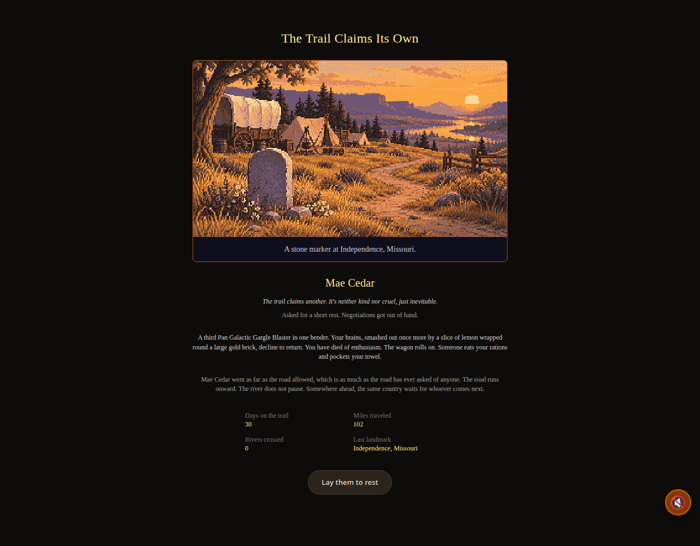
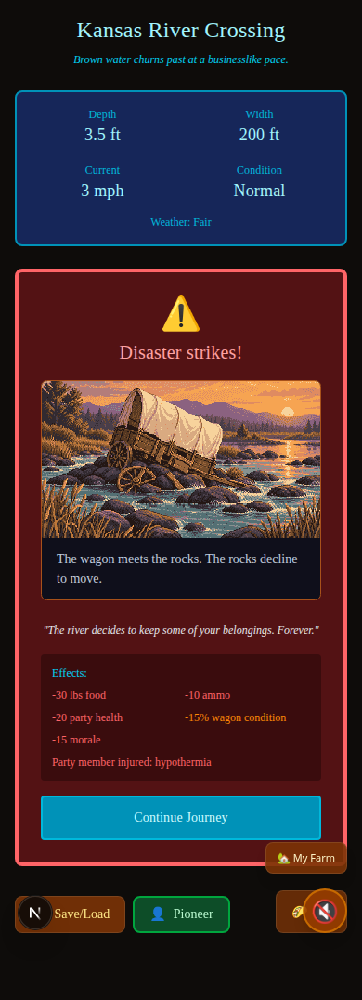

# Slice 4 browser evidence

These screenshots come from disposable local campaign fixtures and normal player actions, using Chrome 151.0.7922.71. They contain no live player save. The town ending uses the real third-drink action; the river result uses the existing failed-ford resolver.

Full local results and all screenshots are under `artifacts/passing-river-art/`. Reproduce with `node --import tsx tools/passingRiverArt.browser.ts all http://127.0.0.1:3344` against a running production build. The harness uses `/opt/google/chrome/chrome`; adjust its executable path for another machine. See `docs/SLICE4_PASSING_RIVER_ART_20260913.md` for scope, tests, and the existing development-mode ranch-save limitation.
